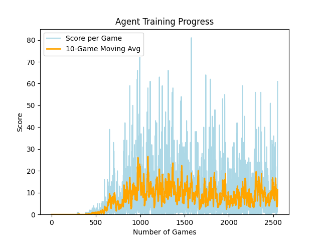

# FLAPPY_BIRD_RL
An AI agent that learns to play Flappy Bird from scratch using a Dueling Double Deep Q-Network. Built entirely with Python, PyTorch, and Pygame.

# Overview
This project bridges classic game development with modern deep reinforcement learning. The agent starts with zero knowledge of the game and learns optimal flight patterns through trial, error, and an epsilon-greedy exploration strategy.

# Features
* Dueling DQN Architecture: Splits state evaluation into Value and Advantage streams for highly stable learning.
* Double Q-Learning: Prevents the overestimation of action values common in standard Q-Learning.
* Experience Replay Buffer: Stores and samples past transitions to break correlation in sequential data.
* Real-time Metrics: Live plotting of scores and moving averages using Matplotlib.

# Training Progress & Metrics
The repository includes a training progression graph tracking the agent's performance over 2,500 games. The learning curve clearly illustrates the distinct phases of reinforcement learning:
* The Exploration Phase (Games 0–500): The agent relies heavily on an epsilon-greedy strategy, taking random actions to understand basic physics and collision penalties. Scores remain near zero.
* The Convergence Phase (Games 500–1,000): As exploration decays, the agent begins exploiting its learned Q-values. The 10-game moving average rises sharply as the agent learns to successfully navigate pipe gaps.
* Peak Performance & Variance (Games 1,000+): The agent achieves its peak raw score (80+ points). The visible fluctuations in the moving average during later games perfectly demonstrate classic Q-learning variance and replay buffer saturation—challenges.

